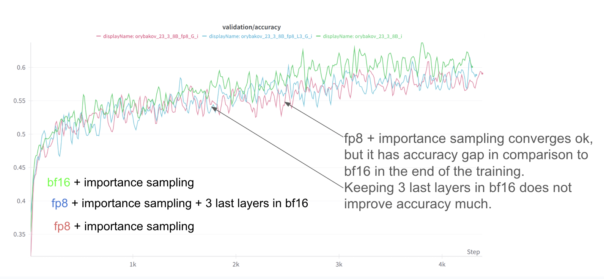

## FP8 for NeMo-RL

This module provides a suite of tools to enable FP8 quantization for large language models. This module is still in developement. Currently we support FP8 generation, using Deepseek style FP8 (sub channel scaling).

NeMo-RL monkey patches several vLLM functions to enable FP8 generations for reinforcement learning. The `init_fp8` function patches key `vLLM` components when initialized:
1.  **RayDistributedExecutor**: For multi-GPU inference, the executor is patched to ensure that every worker process applies the same FP8 patches before model initialization.
2.  **Quantization Utilities**: Functions within `vllm.model_executor.layers.quantization` are replaced with versions that support power-of-2 scaling and other custom features.
3.  **Weight Loading**: A custom `load_weights` function handles the on-the-fly quantization of model weights from a higher-precision format to FP8 with the correct scaling factors.

---

## Usage

FP8 generations are recommended to be configured with the following settings:

   ```
    loss_fn:
        # importance sampling helps improve stability
        use_importance_sampling_correction: true

    policy:
        generation:
            vllm_cfg:
                precision: 'fp8'
                # DeepGemm is much more performant than vLLM's default cutlass fp8 subchannel scaling kernels
                use_deep_gemm: true
                # Keeping the first and last three layers in bf16 reduces the multi-token error without
                # a signficant effect to performance
                num_last_layers_in_bf16: 3
                num_first_layers_in_bf16: 1
                # Use FP32 scaling factors. Rounding scaling factors to the nearest pow2 may improve quantization 
                # fidelity however this feature is still under research.
                use_weight_pow2_scale: False
                use_activation_pow2_scale: False
```

## Accuracy

We observe on the Llama 8b recipe a ~2% accuracy loss is incurred with FP8 generations. Convergence is still under active research and FP8 generations should be used with caution. We are investigating ways to close the accuracy gap and further improve performance. 


